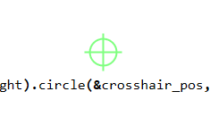

# screen_overlay

A Rust crate that allows drawing click-through overlays over full screen applications:

On Windows:
- Text.
- Bitmap images, support transparancy (tested with a png).
- Lines, circles, rectangles.

On X11:
- Text (no text wrapping).

Mostly intended as a library to allow me to display text as a countdown from my behaviour tree library [betula](https://github.com/iwanders/betula/).

Another use case is adding a crosshair to games that don't have one, the `crosshair` example does this:

## License
License is `MIT OR Apache-2.0`.
